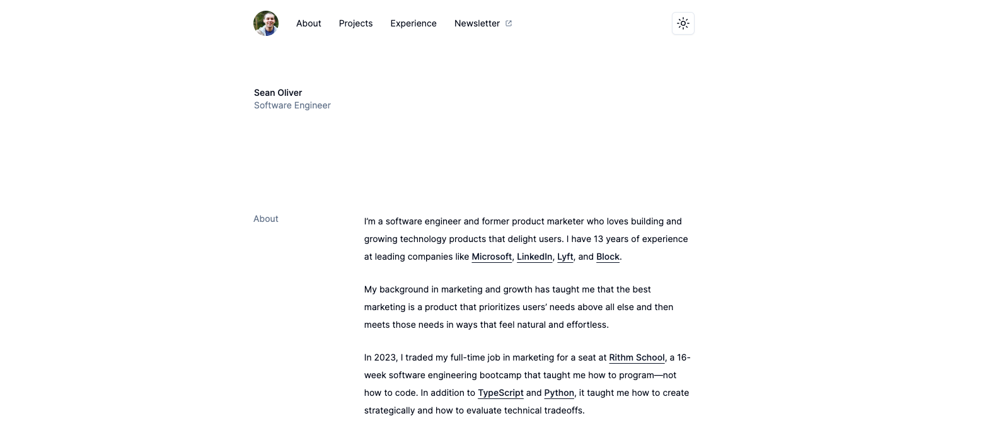

<a name="readme-top"></a>

<div align="center">
  <a href="https://github.com/seanoliver/seanoliver-dot-dev">
    
  </a>

  <h1 align="center">seanoliver [dot] dev</h1>

  <p align="center">
    My minimalist portfolio website built with Next.js, Tailwind CSS, shadcn-ui, and TypeScript.
    <br />
    <br />
    <a href="https://seanoliver.dev/" target="_blank">View Site</a>
    ·
    <a href="https://github.com/seanoliver/seanoliver-dot-dev/issues">Report Bug</a>
    ·
    <a href="https://github.com/seanoliver/seanoliver-dot-dev/issues">Request Feature</a>
  </p>
</div>
<div align="center">


</div>

<!-- TABLE OF CONTENTS -->
<details>
  <summary>Table of Contents</summary>
  <ol>
    <li>
      <a href="#about-the-project">About The Project</a>
      <ul>
        <li><a href="#key-features">Key Features</a></li>
        <li><a href="#built-with">Built With</a></li>
      </ul>
    </li>
    <li>
      <a href="#getting-started">Getting Started</a>
    </li>
    <li><a href="#usage">Usage</a></li>
    <li><a href="#roadmap">Roadmap</a></li>
    <li><a href="#contributing">Contributing</a></li>
    <li><a href="#license">License</a></li>
    <li><a href="#contact">Contact</a></li>
    <li><a href="#acknowledgments">Acknowledgments</a></li>
  </ol>
</details>

<!-- ABOUT THE PROJECT -->

## About The Project

This is my minimalist portfolio website built with Next.js, Tailwind CSS,
shadcn-ui, and TypeScript. It's a great template for a simple personal portfolio
site, and it's a great way to get familiar with shadcn-ui components,
TailwindCSS, and Next.js.

It's also a great starter template using modern web technologies. Feel free to
clone this repo and use it as a base for your own site. Credit is appreciated
but not required.

If you like this project, please consider giving it a ⭐ on GitHub!

<p align="right">(<a href="#readme-top">back to top</a>)</p>

### Key Features

- Dark/Light Mode
- Single Page Application
- Mobile-Friendly Responsive Design
- Scroll-to-Section Navigation using React-Scroll

<p align="right">(<a href="#readme-top">back to top</a>)</p>

### Built With

This project was first built in 2023 using the following technologies.

- ![Nextjs][Nextjs]
- ![TailwindCSS][TailwindCSS]
- ![React][React]
- ![TypeScript][TypeScript]
- ![Nodejs][Nodejs]
- ![shadcn-ui][shadcn-ui]
- ![Vercel][Vercel]

<p align="right">(<a href="#readme-top">back to top</a>)</p>

<!-- GETTING STARTED -->

## Getting Started

This is a great simple template for a personal portfolio site using modern web
technologies. Feel free to clone this repo and use it as a base for your own
portfolio site. Credit is appreciated but not required.

1. Clone and cd into this repository

   ```bash
   git clone https://github.com/seanoliver/seanoliver-dot-dev.git
   cd seanoliver-dot-dev
   ```

2. Install dependencies

   ```bash
   pnpm install
   ```

3. That's it! Run the app. It will be served at `localhost:3000`

   ```bash
    pnpm run dev
   ```

<p align="right">(<a href="#readme-top">back to top</a>)</p>

<!-- ROADMAP -->

## Roadmap

- [ ] Uses Page
- [x] Contentlayer Blog
- [ ] Footer
- [ ] Sticky Nav
- [x] Scroll Links (no packages)
- [x] Social Media Links
- [ ] TBD: Contact Form
- [ ] TBD: Project Details Pages

<p align="right">(<a href="#readme-top">back to top</a>)</p>

<!-- CONTRIBUTING -->

## Contributing

This is a great project base template for a simple personal portfolio site, and
it's a great way to get familiar with shadcn-ui components, TailwindCSS, and
Next.js. Feel free to fork this repo and make it your own. If you have any
questions or suggestions, please feel free to contact me!

1. Fork the Project
2. Create your Feature Branch (`git checkout -b feature/AmazingFeature`)
3. Commit your Changes (`git commit -m 'Add some AmazingFeature'`)
4. Push to the Branch (`git push origin feature/AmazingFeature`)
5. Open a Pull Request

<p align="right">(<a href="#readme-top">back to top</a>)</p>

<!-- LICENSE -->

## License

If you're looking for a lightweight starter template, feel free to clone and
make it your own. Credit is appreciated but not required.

Distributed under the MIT License. See
[LICENSE](https://github.com/seanoliver/seanoliver-dot-dev/LICENSE) for more
information.

<p align="right">(<a href="#readme-top">back to top</a>)</p>

<!-- CONTACT -->

## Contact

Twitter/X: [@SeanOliver](https://twitter.com/SeanOliver)

Project Link:
[https://github.com/seanoliver/seanoliver-dot-dev](https://github.com/seanoliver/seanoliver-dot-dev)

Live Site: [https://seanoliver.dev/](https://seanoliver.dev/)

<p align="right">(<a href="#readme-top">back to top</a>)</p>

<!-- ACKNOWLEDGMENTS -->

## Acknowledgments

Here are some of other amazing minimalist portfolio sites that inspired this
project:

- [Samuel Kraft](https://samuelkraft.com/)
- [Brittany Chiang](https://brittanychiang.com/)
- [Lee Robinson](https://leerob.io/)
- [Pedro Duarte](https://ped.ro/)
- [Jahir Fiquitiva](https://jahir.dev/)
- [shadcn](https://shadcn.com/)

<p align="right">(<a href="#readme-top">back to top</a>)</p>

<!-- TECHNOLOGY BADGES -->

[Nextjs]:
  https://img.shields.io/badge/Next.js-000000?logo=next.js&logoColor=white
[React]: https://img.shields.io/badge/React-20232A?logo=react&logoColor=61DAFB
[TypeScript]:
  https://img.shields.io/badge/TypeScript-007ACC?logo=typescript&logoColor=white
[Nodejs]:
  https://img.shields.io/badge/Node.js-43853D?logo=node.js&logoColor=white
[shadcn-ui]:
  https://img.shields.io/badge/shadcn--ui-FF0000?logo=shadcn-ui&logoColor=white
[TailwindCSS]:
  https://img.shields.io/badge/Tailwind_CSS-38B2AC?logo=tailwind-css&logoColor=white
[Vercel]: https://img.shields.io/badge/Vercel-000000?logo=vercel&logoColor=white
