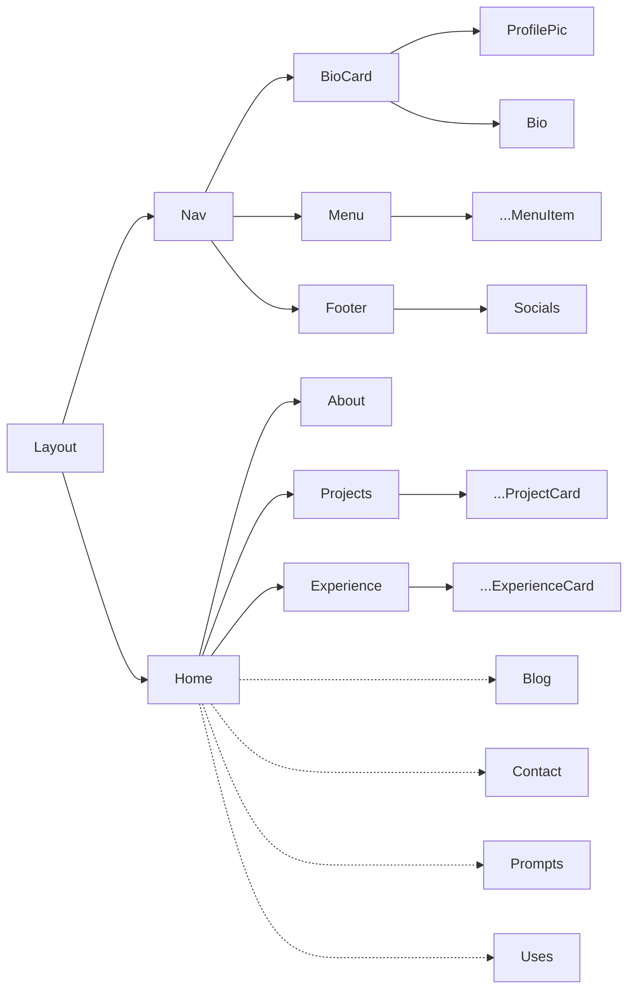

# Sean Oliver's Personal Site

This is my personal site, built with Next.js and Tailwind CSS. It's a work in
progress, but I'm hoping to have it up and running soon.

## TODO

- [ ] Update favicon
- [X] Refactor Title and Subtitle components
- [X] Mobile responsive nav menu
- [X] Fix menu alignment on sub-pages
- [X] Fix alignment of social icons on about page
- [ ] New bio on about page
- [X] Add projects to projects page
- [X] Enable newsletter link
- [ ] Enable newsletter open new tab
- [X] Flip to split layout
- [ ] Implement Scrollspy on Nav
- [ ] Add uses page
- [X] Better naming for images.tsx
- [X] Componetize nav and card elements

## Component Hierarchy

This is a [Next.js](https://nextjs.org/) project bootstrapped with [`create-next-app`](https://github.com/vercel/next.js/tree/canary/packages/create-next-app).